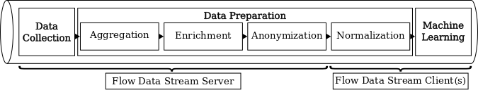

# Flow Data Streaming Client
Dependencies: Python version: 3.6+ (for used packages see [utils.py](utils.py))

## Description and Usage

The Flow Data Streaming Client realizes the Normalization step of the Data Preparation stage as well as the Machine Learning stage (see Flow Data Streaming Pipeline).
Prepared flow data is received from the [Flow Data Streaming Server](https://gitlab.cs.hs-fulda.de/flow-data-ml/cnsm2019/flow-data-streaming-server) and further preprocessed (feature filtering, feature selection, normalization, labeling) and used for model training and testing.
In general, any online model can be implemented and used at the client side.

The Flow Data Streaming Client can be started as follows:
* train and test a fully-connected DNN on streamed, prepared flow data: `python3 fc-dnn_client.py`

### Parameters

While parameters for the server connection handler are specified in [constants.py](constants.py) (e.g., address information), all experiments using the fully-connected DNN client can be configured by command line parameters (see [defaultParser.py](defaultParser.py)).

## Paper Reference
Flow-based Throughput Prediction using Deep Learning and Real-World Network Traffic, CNSM 2019